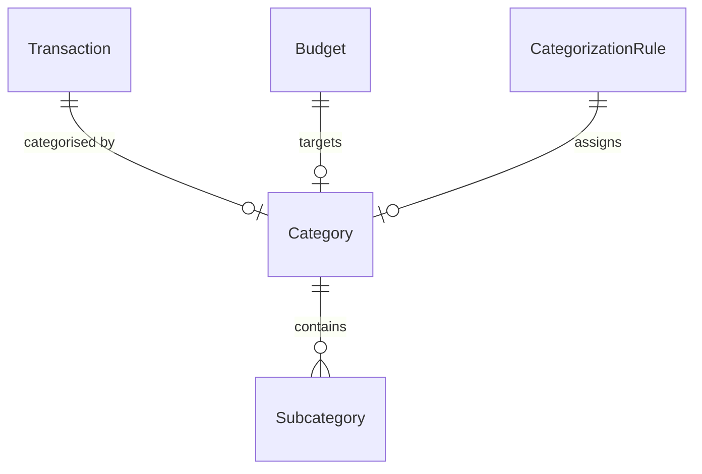

# ms-finances — domain

Aggregates, value objects, invariants and schema. Endpoints: `API.md`. Messaging: `EVENTS.md`.
Shared VOs (`Money`, `Cbu`, `UserId`): parent `.ai/references/APP_STRUCTURE.md`.

## Aggregates

| Aggregate | Root entity | Owned entities | Repository | Key invariant |
|---|---|---|---|---|
| Transaction | `Transaction` | — | `TransactionRepository` | Immutable money movement (`fromCbu`, `toCbu`, `money`); `fromCbu != toCbu`; magnitude always positive; `changeDetails()` only updates category, description, date |
| Category | `Category` | `Subcategory` | `CategoryRepository` | Soft-delete via `CategoryStatus` (`ACTIVE`, `ARCHIVED`); aggregate is unit of save; subcategories nested under parent |
| Budget | `Budget` | — | `BudgetRepository` | Monthly spending target by category/currency; unique per `(userId, categoryId, year, month)` |
| CategorizationRule | `CategorizationRule` | — | `CategorizationRuleRepository` | Pattern-matching rule mapping transaction description to a category |

## Value objects

Service-local only — `Money`, `Cbu`, `UserId` are documented once at the parent.

| VO | What it wraps | Validation it enforces |
|---|---|---|
| `CategoryName` | Category or subcategory display name | Trimmed, non-blank, ≤ 100 chars |
| `DateRange` | `from` and `to` LocalDate pair | `from <= to` invariant enforced in constructor |
| `TransactionId` | Long aggregate ID | Wraps non-null positive ID |
| `CategoryId` | Long category ID | Wraps non-null positive ID |

## Enumerations

| Enum | Values | What decides the value |
|---|---|---|
| `TransactionKind` | `EXPENSE`, `INCOME`, `TRANSFER` | Derived at read time via `TransactionClassifier` based on CBU ownership |
| `CategoryStatus` | `ACTIVE`, `ARCHIVED` | Set explicitly on archive/restore operations |
| `MatchType` | `EXACT`, `CONTAINS`, `STARTS_WITH`, `REGEX` | Set on categorization rule creation |

## Domain services

| Service | The single decision it owns |
|---|---|
| `TransactionClassifier` | Derives `TransactionKind` (`EXPENSE`, `INCOME`, `TRANSFER`) by evaluating `owns(fromCbu)` vs `owns(toCbu)` |
| `TransactionPosting` | Computes signed `BalanceMovement` list per owned account for outbox publishing |
| `TransactionCurrencyValidator` | Enforces currency whitelist compatibility across transaction legs |

## ERD

`OutboxEvent` and `ProcessedInboundEvent` are infrastructure concerns and omitted above.

## Schema `finances`

| Migration | What it adds |
|---|---|
| V1 | `categories` table |
| V2 | `transactions` table |
| V3 | `loans` table (legacy; dropped in V10) |
| V4 | `loan_installments` table (legacy; dropped in V10) |
| V5 | `card_expenses` table (legacy; dropped in V9) |
| V6 | Default categories seed data |
| V7 | `card_expense_installments` table (legacy; dropped in V9) |
| V8 | Performance indexes on transactions and categories |
| V9 | Drops legacy `card_expenses` tables |
| V10 | Drops legacy `loans` tables |
| V11 | Adds `account_id` and `transfer_group_id` columns |
| V12 | Structural reset of transactions data |
| V13 | Unassigned categories fallback |
| V14 | Unassigned subcategories fallback |
| V15 | Restructures transactions to account-to-account (`from_cbu`, `to_cbu`) model |
| V16 | `outbox_event` table |
| V17 | `processed_inbound_event` table (idempotency key for bank payment events) |
| V18 | Collapses unassigned categories and drops presentation columns |
